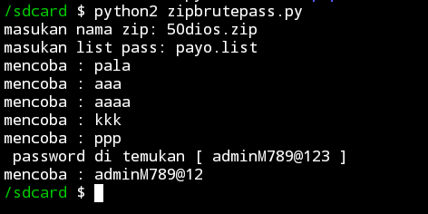

# BFpassword.zip
memecahkan password file.zip 
tidak usah herang sama tools ini ada beberapa YouTube yang membuat tutorial cara membuat tools ini  daripada kesimpan kan mending saya simpan di sini agar bisa di pake sama orang2 yang belum tau   untuk menjalankan tools nya gunakan python2

kalau yang versi tools keren pake tools JTR aja
┌──(kali㉿localhost)-[/sdcard]
└─$ john hash.txt --wordlist=/sdcard/a.list

Using default input encoding: UTF-8
Loaded 1 password hash (PKZIP [32/64])
Will run 8 OpenMP threads
Press 'q' or Ctrl-C to abort, almost any other key for status
adminM789@123    (50dios.zip)
1g 0:00:00:00 DONE (2024-03-27 12:57) 50.00g/s 400.0p/s 400.0c/s 400.0C/s aaaa..228822
Use the "--show" option to display all of the cracked passwords reliably
Session completed.

┌──(kali㉿localhost)-[/sdcard]
└─$ 🦫
